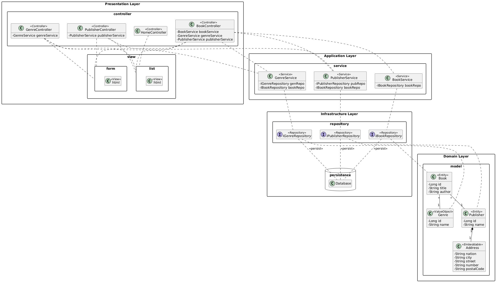

# Book Manager

A Spring Boot web application for managing books, genres, and publishers.
Built with Thymeleaf, Spring Data JPA, and an H2 file-based database.

---

## Table of Contents

- [Overview](#overview)
- [Architecture](#architecture)
- [Domain Model](#domain-model)
- [Technologies](#technologies)
- [Project Structure](#project-structure)
- [Getting Started](#getting-started)
- [Usage](#usage)
- [Testing](#testing)
- [Database](#database)

---

## Overview

Book Manager is a CRUD web application that allows users to:

- Manage **books** with title and author
- Manage **genres** (e.g. Fiction, Horror, Science)
- Manage **publishers** with full address details
- Assign genres and publishers to books

---

## Architecture

The application follows a four-layer architecture:
```
┌─────────────────────────────────┐
│        Presentation Layer       │  Controllers + Thymeleaf Views
├─────────────────────────────────┤
│        Application Layer        │  Services (business logic)
├─────────────────────────────────┤
│          Domain Layer           │  Entities + Value Objects
├─────────────────────────────────┤
│       Infrastructure Layer      │  Repositories + H2 Database
└─────────────────────────────────┘
```
| Layer | Components                                                                      |
|---|---------------------------------------------------------------------------------|
| Presentation | `BookController`, `GenreController`, `PublisherController`, Thymeleaf templates |
| Application | `BookService`, `GenreService`, `PublisherService`                               |
| Domain | `Book`, `Genre`, `Publisher`, `Address`                                         |
| Infrastructure | `IBookRepository`, `IGenreRepository`, `IPublisherRepository`, H2 Database      |

---

## Domain Model

- **Book** `<<Entity>>` — has a title, author, and belongs to one genre and one publisher
- **Genre** `<<ValueObject>>` — has a name (e.g. Fiction, Horror)
- **Publisher** `<<Entity>>` — has a name and an embedded address
- **Address** `<<Embeddable>>` — has nation, city, street, number and postal code

---

## Technology Stack

| Technology        | Purpose                                    |
|-------------------|--------------------------------------------|
| Java 17           | Programming language                       |
| Spring Boot 4.0.6 | Application framework                      |
| Spring MVC        | Web layer (controllers)                    |
| Spring Data JPA   | Database access (repositories)             |
| Hibernate         | ORM - maps Java classes to DB tables       |
| H2                | File-based relational database             |
| Thymeleaf         | Server-side HTML templating                |
| JUnit 5           | Unit and integration testing               |
| Mockito           | Mocking for unit tests                     |
| Maven             | Build and dependency management            |

---

## Architecture
#### Uml Class Diagram:


---

## Project Structure
```
src/
├── main/
│   ├── java/org/example/bookmanager/
│   │   ├── BookmanagerApplication.java
│   │   └── backend/
│   │       ├── controller/
│   │       │   ├── BookController.java
│   │       │   ├── GenreController.java
│   │       │   ├── HomeController.java
│   │       │   └── PublisherController.java
│   │       ├── exceptions/
│   │       │   ├── BookNotFoundException.java
│   │       │   ├── GenreNotFoundException.java
│   │       │   └── PublisherNotFoundException.java
│   │       ├── model/
│   │       │   ├── Address.java
│   │       │   ├── Genre.java
│   │       │   ├── Publisher.java
│   │       │   └── Book.java
│   │       ├── repository/
│   │       │   ├── IBookRepository.java
│   │       │   ├── IGenreRepository.java
│   │       │   └── IPublisherRepository.java
│   │       └── service/
│   │           ├── BookService.java
│   │           ├── GenreService.java
│   │           └── PublisherService.java
│   └── resources/
│       ├── static/css/
│       │   └── style.css
│       ├── templates/
│       │   ├── books/
│       │   │   ├── form.html
│       │   │   └── list.html
│       │   ├── genres/
│       │   │   ├── form.html
│       │   │   └── list.html
│       │   └── publishers/
│       │       ├── form.html
│       │       └── list.html
│       └── application.properties
└── test/
    └── java/org/example/bookmanager/
        ├── BookmanagerApplicationTests.java
        └── BookmanagerIntegrationTests.java
```
---

## Getting Started

### Prerequisites

- Java 17 or higher
- Maven 3.9 or higher

### Run the application

```bash
# Clone the repository
git clone https://github.com/MauiMoz/Book-Management-System.git

# Navigate to the bookmanager folder
cd path/to/bookmanager

# Run with Maven
./mvnw spring-boot:run
```

Open your browser at: http://localhost:8080

---

## Usage

### Recommended order

Since books require a genre and publisher to be assigned, create them first:

1. Go to **Genres** → add at least one genre
2. Go to **Publishers** → add at least one publisher
3. Go to **Books** → add books and assign genre and publisher

If no genre or publisher is assigned, the book will display them as "None".

### Endpoints

| URL                     | Description          |
|-------------------------|----------------------|
| `/books`                | List all books       |
| `/books/new`            | Add a new book       |
| `/books/edit/{id}`      | Edit an existing book |
| `/books/delete/{id}`    | Delete a book        |
| `/genres`               | List all genres      |
| `/genres/new`           | Add a new genre      |
| `/genres/edit/{id}`     | Edit an existing genre |
| `/genres/delete/{id}`   | Delete a genre       |
| `/publishers`           | List all publishers  |
| `/publishers/new`       | Add a new publisher  |
| `/publishers/edit/{id}` | Edit an existing publisher  |
| `/publishers/delete/{id}`    | Delete a publisher   |

---

## Testing

The project includes two types of tests:

### Unit tests (Mockito)

Fast, isolated tests that mock the repository layer:

```bash
./mvnw test
```

Covers:
- `testGetAllBooks()` — returns correct list
- `testGetAllBooksEmpty()` — handles empty list
- `testGetBookById()` — returns correct book
- `testGetBookByIdNotFound()` — throws exception
- `testSaveBook()` — saves and returns book
- `testSaveBookWithAuthor()` — saves all fields
- `testDeleteBook()` — calls deleteById once

Genre and Publisher are equivalent

### Integration tests (SpringBootTest)

Boots the full application with a real H2 database:

- `testSaveAndRetrieveBook()` — end-to-end save and read
- `testDeleteBook()` — save then delete
- `testUpdateBook()` — save then update title
- `testSaveAndRetrieveGenre()`
- `testSaveAndRetrievePublisher()`

---

## Database

The application uses an **H2 file-based database** that persists data between restarts.

### Configuration (`application.properties`)

```properties
spring.application.name=bookmanager
spring.datasource.url=jdbc:h2:file:./data/bookdb
spring.datasource.driver-class-name=org.h2.Driver
spring.datasource.username=sa
spring.datasource.password=
spring.jpa.hibernate.ddl-auto=update
spring.jpa.show-sql=true
spring.h2.console.enabled=true
spring.h2.console.path=/h2-console
```

